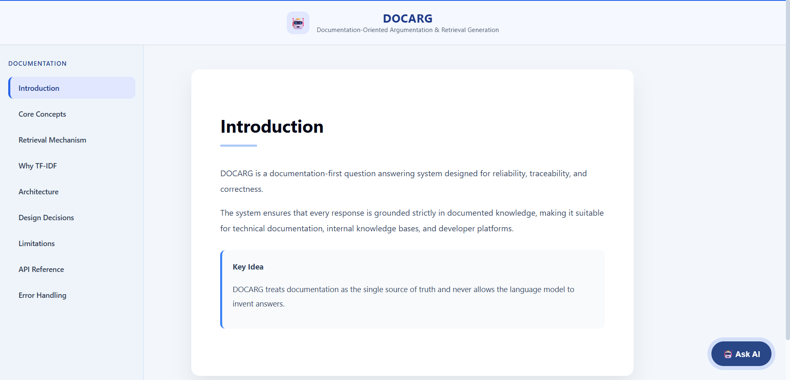
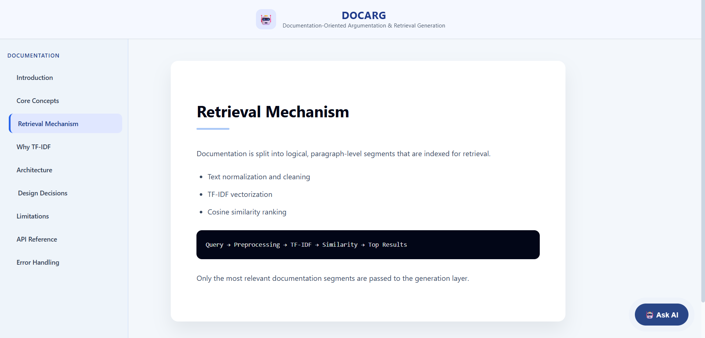
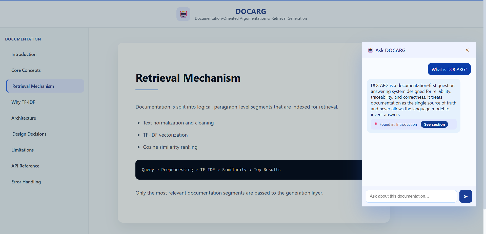
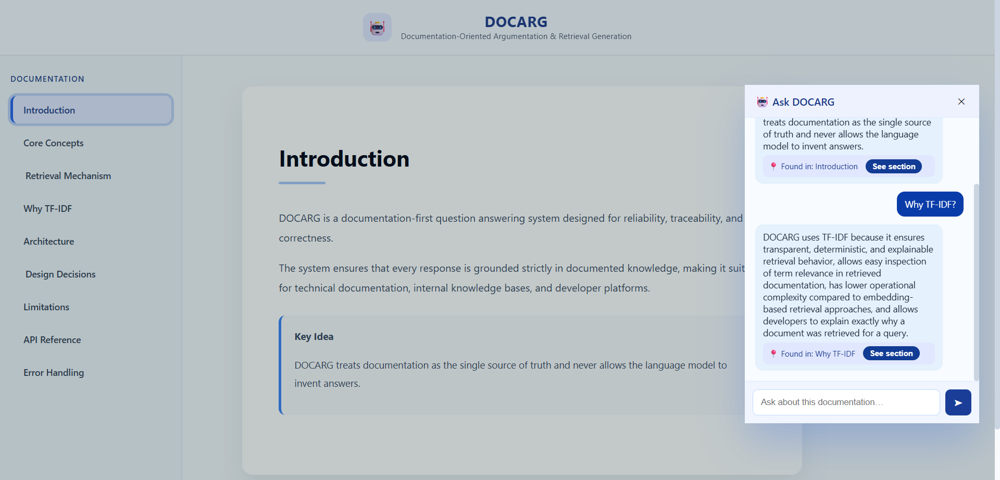

# DOCARG – Document-Oriented Argumentation & Retrieval Generation (RAG) Website Chatbot

DOCARG is a **documentation-first Retrieval-Augmented Generation (RAG) system** that answers user questions strictly based on curated documentation.  
It is designed to **eliminate hallucinations** by treating documentation as the single source of truth.

In this project, *argumentation* refers to generating **well-grounded, explainable responses derived entirely from retrieved documents**, not debate-style or opinion-based arguments.

Unlike typical RAG systems that rely heavily on an LLM’s internal knowledge, DOCARG retrieves explicit documentation segments and uses an LLM **only for rephrasing and summarization**, never for introducing new information.

---

## 🔍 Key Idea

> If the documentation does not explicitly contain the answer, the system clearly responds with  
> **“I don’t know based on the given documentation.”**

This makes DOCARG reliable, transparent, and suitable for real-world documentation websites.

---

## ✨ Features

- 📄 **Documentation-first RAG architecture**
- 🔎 **TF-IDF–based retrieval** with strict grounding
- 🧩 Paragraph-level, answer-complete chunks
- 🧠 LLM used only for formatting (no hallucination)
- 📌 Clear **source attribution** for every answer
- 🛑 Safe failure when information is missing
- 🗂️ Query logging for retrieval transparency
- 🌐 Designed to work with a **React documentation frontend**
- ⚙️ FastAPI backend designed for independent deployment

---

## 🏗️ System Architecture

1. Documentation is written as **explicit, answer-complete statements**
2. Documentation is chunked at paragraph level
3. TF-IDF vectors are generated from documentation
4. User queries are vectorized using the same pipeline
5. Top relevant chunks are retrieved using cosine similarity
6. The LLM rephrases retrieved content **without adding new facts**
7. Responses include **source section attribution**

---

## 🛠️ Tech Stack

### Backend
- Python
- FastAPI
- TF-IDF (scikit-learn)
- Sentence preprocessing (stemming, n-grams)
- Uvicorn

### Frontend
- React (documentation website)
- Floating “Ask AI” chatbot

---

## 📸 Screenshots

### Documentation Interface

### Retrieval Mechanism Explanation

### Ask DOCARG – Welcome State

### Answer with Source Attribution

### Multiple Queries Handling

---

## 🎯 Design Philosophy

DOCARG prioritizes:
- **Correctness over creativity**
- **Transparency over fluency**
- **Explicit documentation over model memory**

This makes it ideal for:
- Technical documentation sites
- Internal knowledge bases
- Developer tools
- Educational platforms

---

## 📌 Future Enhancements

- Single Markdown source for both frontend & backend
- Hybrid retrieval (TF-IDF + embeddings)
- Section-wise confidence scoring
- Admin dashboard for documentation updates
- Authentication & usage analytics

---

## 👩‍💻 Author

Built with care as a **documentation-centric RAG project** focused on reliability, traceability, and real-world applicability.
